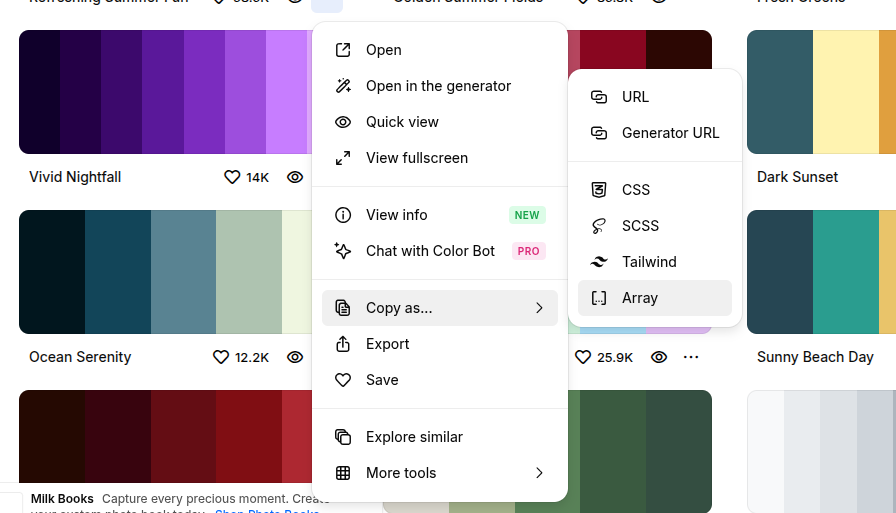
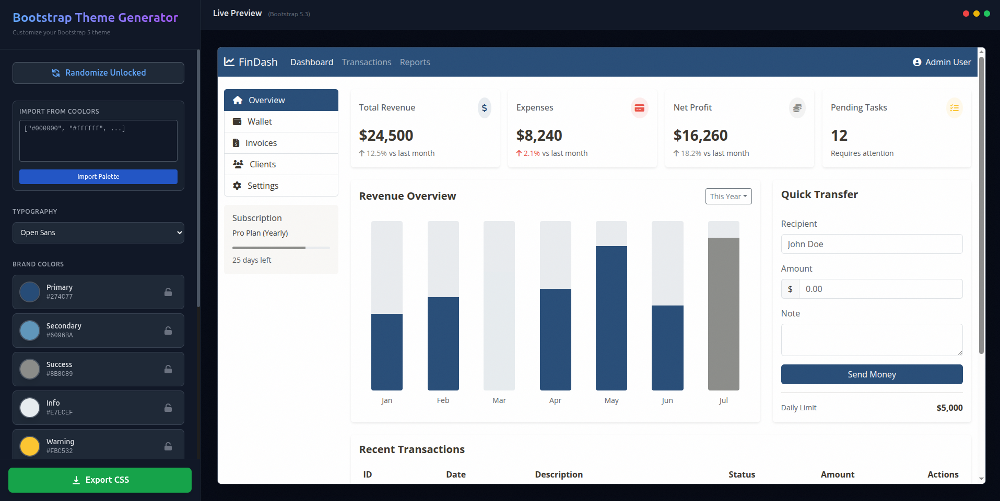

# Vibe Coded Bootstrap5 Color Theme Generator

Generate a .css file which you can just import in your Bootstrap5 website to give it a new look. 

Gemini3 built this from prompts. Pretty good.

**Features**

- Import colors as array from [coolors.co](https://coolors.co/palettes/trending);

- Button to randomize color themes;
- Lock in colors you like;
- Manually pick up colors;
- See how it looks with most popular fonts;

**Dev Setup**

1. Install dependencies:
   `npm install`
2. Run the app:
   `npm run dev`
3. Build assets:
   `npm run build`
